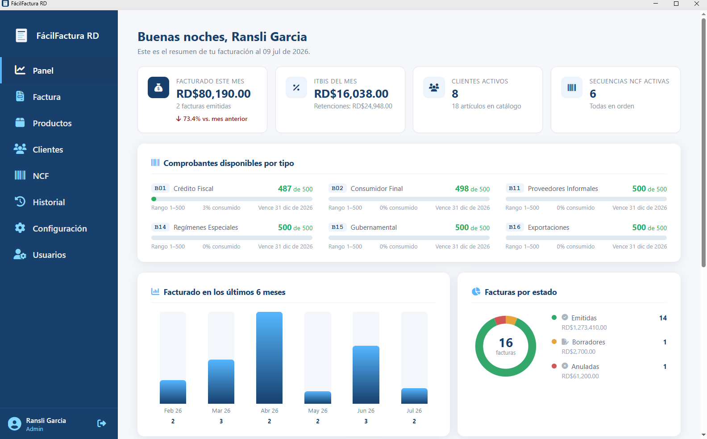
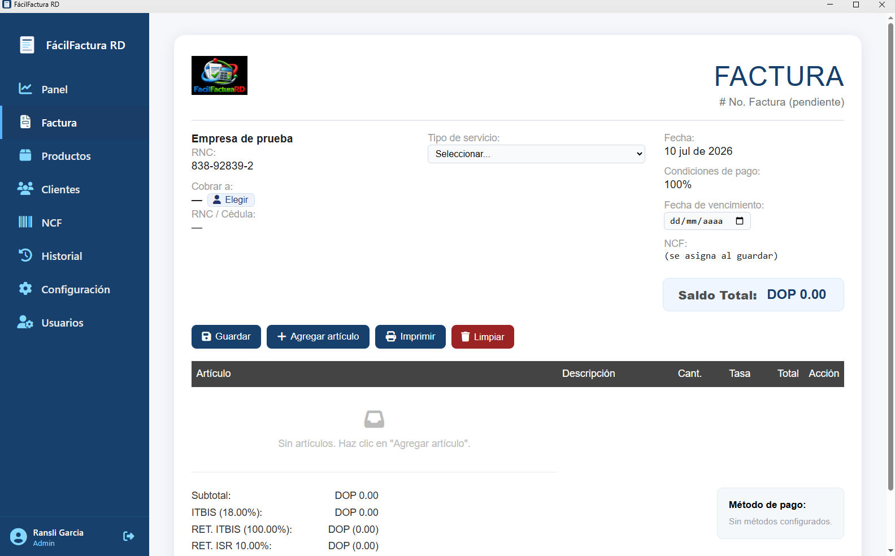
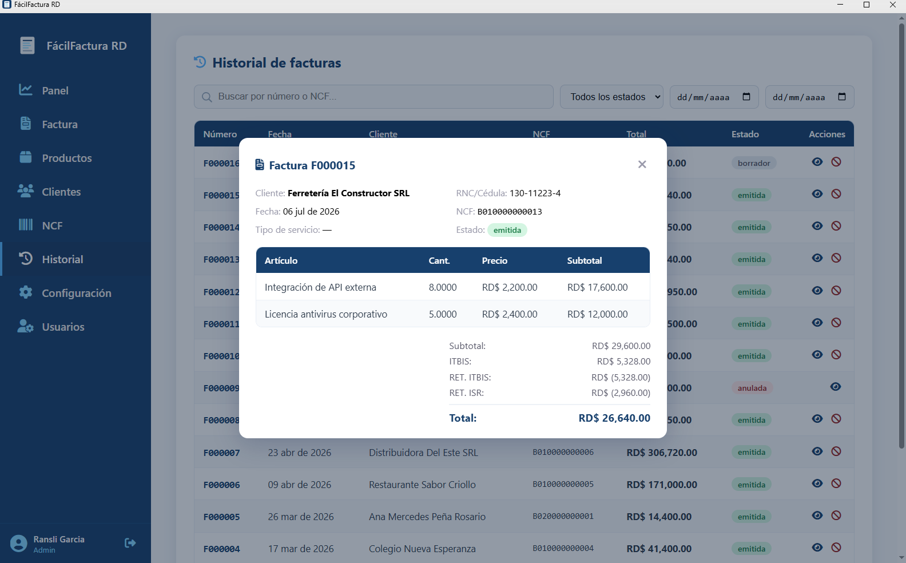
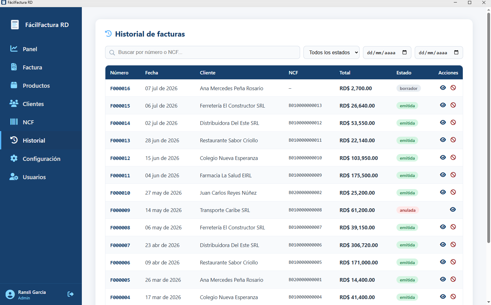
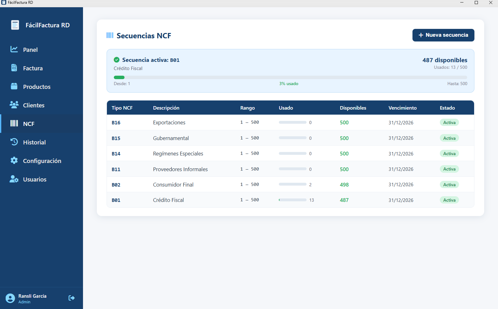
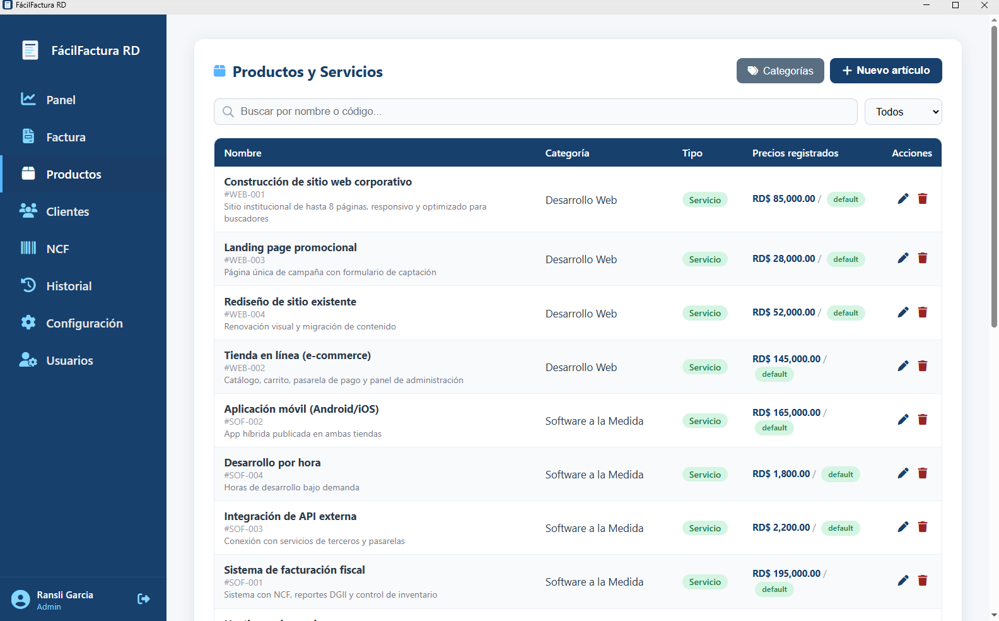
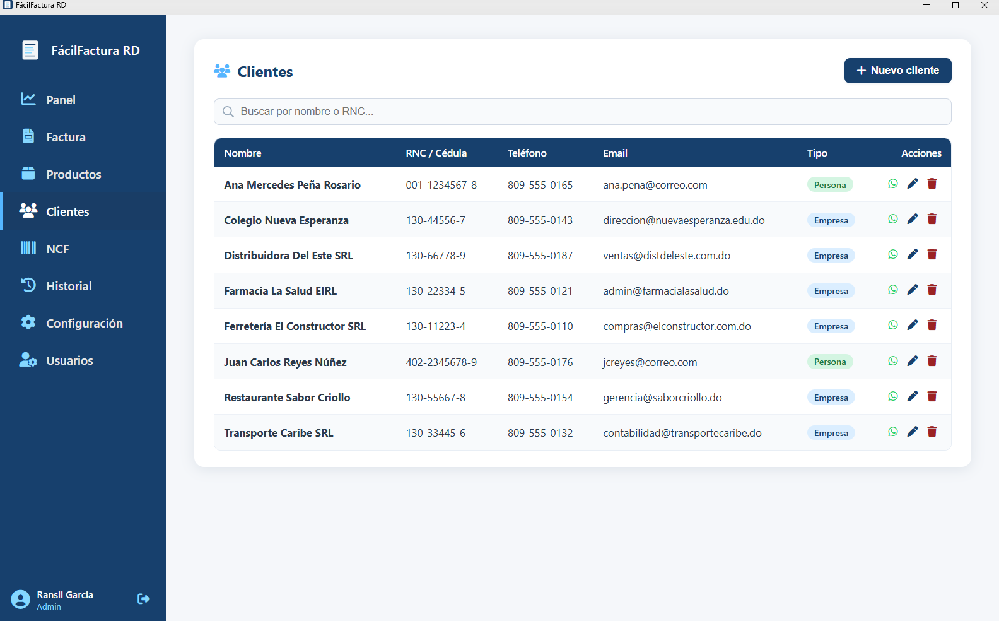
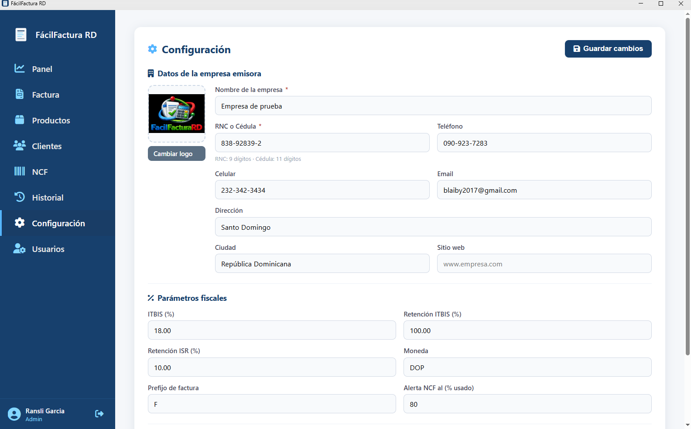
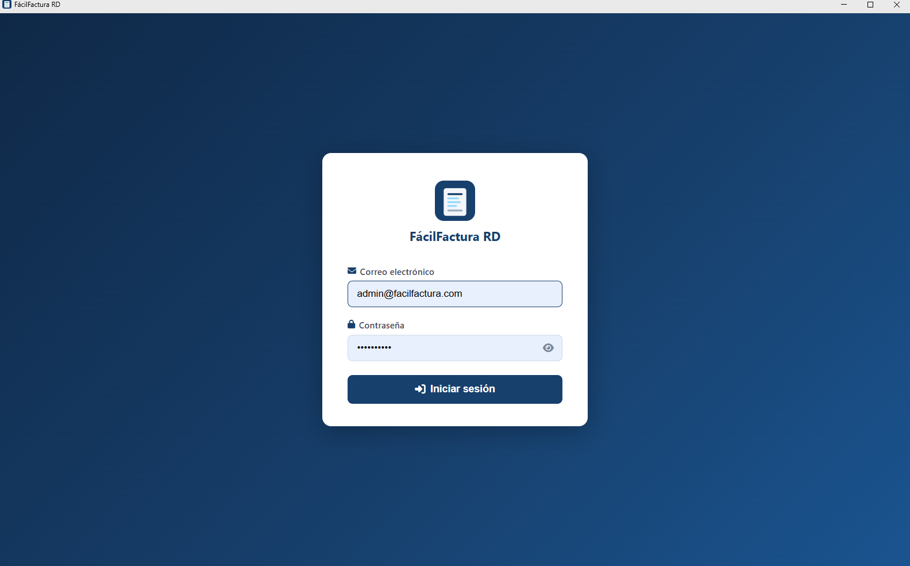

# FácilFactura RD

Sistema de facturación electrónica con soporte de Números de Comprobante Fiscal (NCF)
conforme a los lineamientos de la DGII de la República Dominicana.

## Descripción

FácilFactura RD es una aplicación web full-stack orientada a PYMEs dominicanas que
requieren emitir facturas con NCF válidos ante la DGII. El sistema permite gestionar
clientes, artículos, secuencias NCF y emitir facturas con cálculo automático de ITBIS,
retenciones e ISR.

## Objetivo

Automatizar y simplificar el proceso de facturación de las pequeñas y medianas empresas
dominicanas, reduciendo los errores humanos en el cálculo de impuestos, garantizando el
cumplimiento de la normativa fiscal de la DGII en materia de NCF, ITBIS y retenciones, y
brindando visibilidad financiera en tiempo real mediante un panel de indicadores.

A diferencia de las alternativas comerciales del mercado, el sistema se despliega en la
infraestructura propia de la empresa y no genera costos de licencia recurrentes: todo el
stack tecnológico es de código abierto.

## Funcionalidades

- **Autenticación JWT** con control de acceso por roles (admin, facturador, visor).
- **Gestión de clientes** (personas y empresas) con búsqueda por nombre o RNC.
- **Catálogo de productos y servicios** con múltiples precios por unidad de medida
  y soporte para artículos con dimensiones (ancho × alto, ej. banners y lonas).
- **Secuencias NCF**: registro de rangos autorizados por la DGII con **alerta automática**
  cuando la secuencia se acerca a su límite.
- **Emisión de facturas** con asignación automática del NCF y cálculo de ITBIS,
  retención de ITBIS y retención de ISR.
- **Historial de facturas** con filtros por estado, fecha y número/NCF, vista de detalle
  y anulación.
- **Configuración**: datos de la empresa emisora, logo, parámetros fiscales y métodos de pago.
- **Impresión** de la factura y envío rápido por WhatsApp.
- **Panel de control** con el facturado del mes, el ITBIS acumulado, la evolución de los
  últimos seis meses y el consumo de cada secuencia NCF.
- **Autoguardado** de la factura en edición: recargar el navegador no pierde el trabajo,
  y el borrador no consume número de factura ni NCF.

## Tecnologías

**Frontend:** React 18 · Vite · CSS puro
**Backend:** Node.js · Express · JWT · bcryptjs · Multer · MySQL2
**Base de datos:** MySQL / MariaDB

## Estructura del proyecto

```
facilfactura-rd/
├── package.json          # scripts para levantar todo el proyecto
├── backend/              # API REST (Express)
│   ├── config/           # conexión a la base de datos
│   ├── middleware/       # autenticación y roles
│   ├── routes/           # endpoints por módulo
│   ├── seed-usuarios.js  # usuarios iniciales
│   ├── seed-ncf.js       # secuencias NCF de los 6 tipos de comprobante
│   ├── seed-demo.js      # empresa, clientes, catálogo y facturas de ejemplo
│   └── fix-acentos.js    # repara acentos si el schema se importó sin utf8mb4
├── frontend/             # SPA (React + Vite)
│   └── src/
│       ├── vistas/       # Panel, Factura, Productos, Clientes, NCF, Historial, Configuración
│       ├── components/   # menú lateral, toasts, modal de categorías
│       ├── utils/        # formato de RNC/cédula, autoguardado del borrador
│       └── context/      # contexto de autenticación
├── database/
│   └── schema.sql        # 14 tablas con relaciones FK
└── docs/
    └── capturas/         # capturas de pantalla del sistema en funcionamiento
```

## Instalación y ejecución

### Requisitos previos
- Node.js v18+
- MySQL o MariaDB (XAMPP sirve para desarrollo local)
- Git

### 1. Clonar el repositorio
```bash
git clone https://github.com/Ransli/facilfactura-rd.git
cd facilfactura-rd
```

### 2. Crear la base de datos
```bash
mysql -u root -p < database/schema.sql
```

### 3. Configurar el backend
```bash
cd backend
cp .env.example .env      # edita las credenciales de MySQL y el JWT_SECRET
cd ..
```

### 4. Instalar dependencias (raíz, backend y frontend)
```bash
npm run install:all
```

### 5. Cargar los datos iniciales
```bash
cd backend
node seed-usuarios.js   # usuarios del sistema
node seed-ncf.js        # secuencias NCF de los 6 tipos de comprobante
node seed-demo.js       # opcional: empresa, clientes, catálogo y facturas de ejemplo
cd ..
```
Los tres scripts son idempotentes: si se ejecutan dos veces no duplican nada.
`seed-usuarios.js` crea tres usuarios de prueba:

| Rol         | Email                          | Contraseña     |
|-------------|--------------------------------|----------------|
| admin       | admin@facilfactura.com         | Admin2025!     |
| facturador  | facturador@facilfactura.com    | Factura2025!   |
| visor       | visor@facilfactura.com         | Visor2025!     |

> Si ya tenías la base creada antes de este cambio y ves acentos rotos
> (`Dise?o gr?fico`), ejecuta `node fix-acentos.js` desde `backend/`.

### 6. Levantar el proyecto (backend + frontend juntos)
```bash
npm run dev
```
- Frontend: http://localhost:5175
- API:      http://localhost:3002/api

> También puedes ejecutarlos por separado con `npm run dev:backend` y `npm run dev:frontend`.

## Capturas de pantalla

### Panel de control

Resumen del facturado del mes, consumo de las secuencias NCF, evolución de los últimos
seis meses y distribución de las facturas por estado.



### Emisión de facturas

Cálculo automático de ITBIS, retenciones e ISR, con asignación del NCF al guardar.



### Detalle de un comprobante emitido

Factura con su NCF asignado y el desglose fiscal completo.



### Historial de facturas

Filtros por número, NCF, fecha y estado. Las facturas anuladas conservan su NCF.



### Secuencias NCF

Rangos autorizados por la DGII, con alertas de agotamiento y vencimiento.



### Catálogo de productos y servicios



### Gestión de clientes

Validación y formato automático de RNC (9 dígitos) y cédula (11 dígitos).



### Configuración fiscal



### Inicio de sesión



## Autores

Proyecto desarrollado por el **Grupo I** para la asignatura Seminario de Proyecto I (ISW410),
Escuela de Ingeniería y Tecnología, Universidad Abierta para Adultos (UAPA).
Trimestre Mayo–Julio 2026. Facilitador: Ing. Henry Candelario.

| Integrante | Matrícula | Aportes principales |
|---|---|---|
| **Ransli Rafael García Amarante** | 100044493 | Arquitectura, base de datos, autenticación, facturación, panel de control e interfaz de usuario |
| **Carlos Batista** | 100056995 | Módulos de backend: clientes, categorías, unidades de medida, artículos y NCF |

## Licencia

Distribuido bajo licencia MIT. Ver el archivo [LICENSE](LICENSE) para más detalles.
